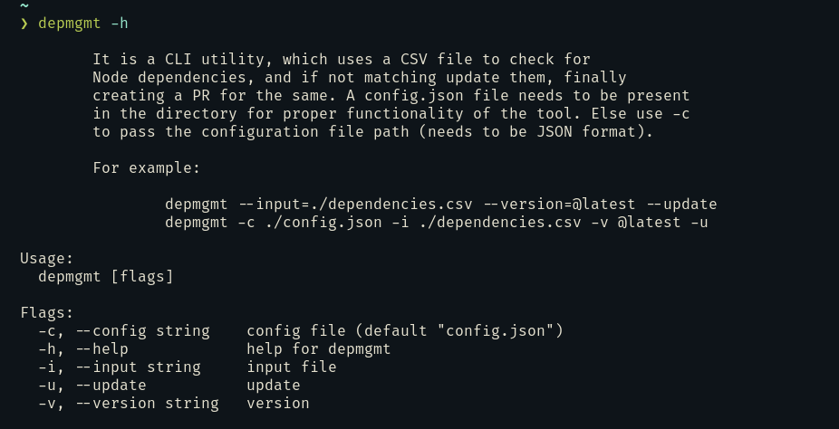
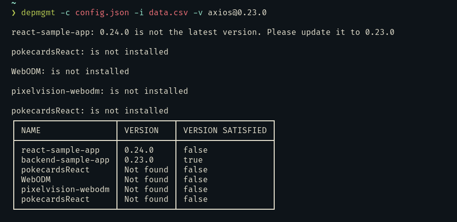
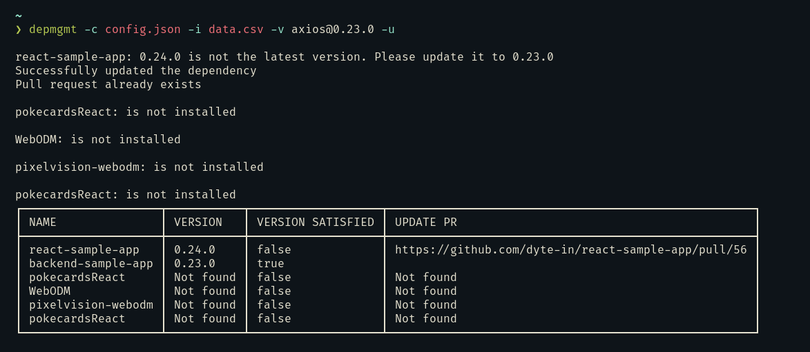

[](https://classroom.github.com/online_ide?assignment_repo_id=7942334&assignment_repo_type=AssignmentRepo)

<div id="top"></div>
<!--
*** Thanks for checking out the Best-README-Template. If you have a suggestion
*** that would make this better, please fork the repo and create a pull request
*** or simply open an issue with the tag "enhancement".
*** Don't forget to give the project a star!
*** Thanks again! Now go create something AMAZING! :D
-->

<!-- PROJECT SHIELDS -->
<!--
*** I'm using markdown "reference style" links for readability.
*** Reference links are enclosed in brackets [ ] instead of parentheses ( ).
*** See the bottom of this document for the declaration of the reference variables
*** for contributors-url, forks-url, etc. This is an optional, concise syntax you may use.
*** https://www.markdownguide.org/basic-syntax/#reference-style-links
-->

[![Contributors][contributors-shield]][contributors-url]
[![Forks][forks-shield]][forks-url]
[![Stargazers][stars-shield]][stars-url]
[![Issues][issues-shield]][issues-url]
[![MIT License][license-shield]][license-url]
[![LinkedIn][linkedin-shield]][linkedin-url]

<!-- PROJECT LOGO -->
<br />
<div align="center">
  <a href="https://github.com/dyte-submissions/dyte-vit-2022-bhavyagoel">
    
  </a>

<h1 align="center">depmgmt</h1>

  <p align="center">
    A CLI tool for managing your dependencies.
    <br />
    <a href="https://github.com/dyte-submissions/dyte-vit-2022-bhavyagoel"><strong>Explore the docs »</strong></a>
    <br />
    <br />
    <a href="https://github.com/dyte-submissions/dyte-vit-2022-bhavyagoel">View Demo</a>
    ·
    <a href="https://github.com/dyte-submissions/dyte-vit-2022-bhavyagoel/issues">Report Bug</a>
    ·
    <a href="https://github.com/dyte-submissions/dyte-vit-2022-bhavyagoel/issues">Request Feature</a>
  </p>
</div>

<!-- TABLE OF CONTENTS -->
<details>
  <summary>Table of Contents</summary>
  <ol>
    <li>
      <a href="#about-the-project">About The Project</a>
      <ul>
        <li><a href="#built-with">Built With</a></li>
      </ul>
    </li>
    <li>
      <a href="#getting-started">Getting Started</a>
      <ul>
        <li><a href="#prerequisites">Prerequisites</a></li>
        <li><a href="#installation">Installation</a></li>
      </ul>
    </li>
    <li><a href="#usage">Usage</a></li>
    <li><a href="#contributing">Contributing</a></li>
    <li><a href="#license">License</a></li>
    <li><a href="#contact">Contact</a></li>
    <li><a href="#acknowledgments">Acknowledgments</a></li>
  </ol>
</details>

<!-- ABOUT THE PROJECT -->

## About The Project
A CLI tool for managing your dependencies, updating them, and creating PRs. This is built as the submission of the Dyte Hiring Challenge. 
The project doesn't uses any third-party libraries, and is built with the following `go` packages:
  - `bufio`
  - `bytes`
  - `context`
  - `encoding/csv`
  - `encoding/json`
  - `fmt`
  - `log`
  - `net/http`
  - `os`
  - `github.com/google/go-github/v45/github`
  - `github.com/jedib0t/go-pretty/table`
  - `github.com/spf13/cobra`
  - `golang.org/x/oauth2`

<p align="right">(<a href="#top">back to top</a>)</p>

### Built With

- [Go](https://golang.org/)
- [GitHub-API](https://developer.github.com/v3/)


<!-- GETTING STARTED -->

## Getting Started

`depmgmt` is a simple, yet powerful command line tool for managing your dependencies. It checks for outdated dependencies, and if they are outdated, it will update them for you. It will also create a ``fork` of the repo if you don't have one, finally it will also create a pull request for you. If a pull request already exists, it will update it.

<p align="right">(<a href="#top">back to top</a>)</p>

### Prerequisites

- [Go](https://golang.org/)
- [Git](https://git-scm.com/)
- [GitHub-API](https://developer.github.com/v3/)

<p align="right">(<a href="#top">back to top</a>)</p>

### Installation

Install `depmgmt` with `go`:

```bash
go install github.com/dyte-submissions/dyte-vit-2022-bhavyagoel
```

<p align="right">(<a href="#top">back to top</a>)</p>

### Usage

`depmgmt` is a command line tool for managing your dependencies. It checks for dependencies you have installed, and if they are not installed, it will install them for you. You can also check for outdated dependencies, and if they are outdated, it will update them for you.

<br>

Help information:

```bash
$ depmgmt -h
```



Check for outdated dependencies:

```bash
$ depmgmt -c path_to_config -i path_to_csv -v name@version
```


Update dependencies and create a pull request:

```bash
$ depmgmt -c path_to_config -i path_to_csv -v name@version -u
```

<p align="right">(<a href="#top">back to top</a>)</p>

### Prerequisites

Here are some things you need to do before you can get started.

- go
  - Ubuntu: `sudo apt-get install golang`
  - Fedora: `sudo dnf install golang`
  - Arch: `sudo pacman -S go`
  - MacOS: `brew install go`
### Installation

1. Get a free API Key at [github.com](https://github.com/settings/tokens)
2. Clone the repo
   ```sh
   git clone https://github.com/dyte-submissions/dyte-vit-2022-bhavyagoel.git
   ```
3. Install Go packages and
   ```sh
    cd dyte-vit-2022-bhavyagoel
    go get github.com/dyte-submissions/dyte-vit-2022-bhavyagoel
    go build
    go install
   ```
4. Run the app
   ```sh
     depmgmt -h
   ```
5. Create `config.json` file
   ```json
   {
     "AUTH_TOKEN": "your_auth_token",
     "TOKEN_USER": "your_token_user"
   }
   ```


See the [open issues](https://github.com/dyte-submissions/dyte-vit-2022-bhavyagoel/issues) for a full list of proposed features (and known issues).

<p align="right">(<a href="#top">back to top</a>)</p>

<!-- CONTRIBUTING -->

## Contributing

Contributions are what make the open source community such an amazing place to learn, inspire, and create. Any contributions you make are **greatly appreciated**.

If you have a suggestion that would make this better, please fork the repo and create a pull request. You can also simply open an issue with the tag "enhancement".
Don't forget to give the project a star! Thanks again!

1. Fork the Project
2. Create your Feature Branch (`git checkout -b feature/AmazingFeature`)
3. Commit your Changes (`git commit -m 'Add some AmazingFeature'`)
4. Push to the Branch (`git push origin feature/AmazingFeature`)
5. Open a Pull Request

<p align="right">(<a href="#top">back to top</a>)</p>

<!-- LICENSE -->

## License

Distributed under the MIT License. See `LICENSE` for more information.


<!-- CONTACT -->

## Contact

Your Name - [@GoelBhavya](https://twitter.com/GoelBhavya) - bgoel4132@gmail.com

Project Link: [github.com/dyte-submissions/dyte-vit-2022-bhavyagoel](https://github.com/dyte-submissions/dyte-vit-2022-bhavyagoel)


<!-- ACKNOWLEDGMENTS -->

## Acknowledgments
- [Bhavya Goel](https://github.com/bhavyagoel)

<p align="right">(<a href="#top">back to top</a>)</p>

<!-- MARKDOWN LINKS & IMAGES -->
<!-- https://www.markdownguide.org/basic-syntax/#reference-style-links -->

[contributors-shield]: https://img.shields.io/github/contributors/github_username/repo_name.svg?style=for-the-badge
[contributors-url]: https://github.com/dyte-submissions/dyte-vit-2022-bhavyagoel/graphs/contributors
[forks-shield]: https://img.shields.io/github/forks/github_username/repo_name.svg?style=for-the-badge
[forks-url]: https://github.com/dyte-submissions/dyte-vit-2022-bhavyagoel/network/members
[stars-shield]: https://img.shields.io/github/stars/github_username/repo_name.svg?style=for-the-badge
[stars-url]: https://github.com/dyte-submissions/dyte-vit-2022-bhavyagoel/stargazers
[issues-shield]: https://img.shields.io/github/issues/github_username/repo_name.svg?style=for-the-badge
[issues-url]: https://github.com/dyte-submissions/dyte-vit-2022-bhavyagoel/issues
[license-shield]: https://img.shields.io/github/license/github_username/repo_name.svg?style=for-the-badge
[license-url]: https://github.com/dyte-submissions/dyte-vit-2022-bhavyagoel/blob/master/LICENSE.txt
[linkedin-shield]: https://img.shields.io/badge/-LinkedIn-black.svg?style=for-the-badge&logo=linkedin&colorB=555
[linkedin-url]: https://linkedin.com/in/bgoel4132
[product-screenshot]: images/screenshot.png
